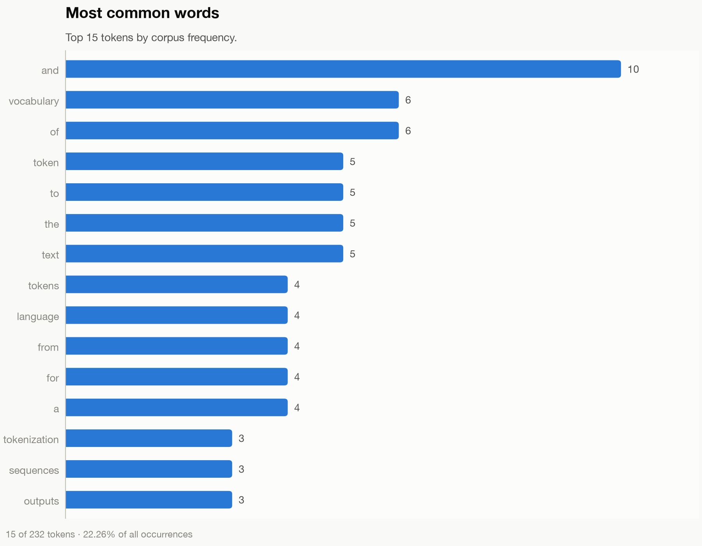
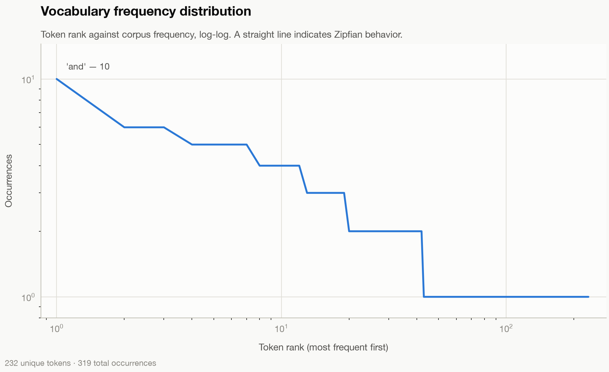

# Tokenizer From Scratch

[](https://www.python.org/)
[](LICENSE)
[](https://docs.python.org/3/library/typing.html)
[](#architecture)
[](#project-overview)

A production-oriented NLP tokenizer project built from first principles using pure Python.  
Designed to be readable for students, credible for recruiters, and extensible for ML/NLP engineers.

---

## Project Overview

`Tokenizer From Scratch` is an end-to-end text tokenization pipeline that demonstrates how modern NLP preprocessing systems can be designed without external NLP frameworks such as NLTK, spaCy, or HuggingFace.

The project focuses on:

- building a frequency-based vocabulary
- robust text cleaning and normalization
- deterministic token-to-id encoding
- id-to-token decoding
- reproducible configuration-driven workflows
- artifact generation for downstream model training

This repository is ideal for:

- **Recruiters** evaluating software engineering quality in ML projects
- **Machine Learning Engineers** who need a clean baseline tokenizer
- **NLP Engineers** who want a controllable preprocessing stack
- **Students** learning practical tokenizer internals

---

## Architecture

The system follows a modular, object-oriented design. Each module owns one responsibility and can be tested independently.

```text
app.py (orchestrator)          demo.py (interactive walkthrough)
 ├─ configs/            -> typed configuration loading + validation
 ├─ preprocessing/      -> dataset loading + text cleaning
 ├─ algorithms/         -> tokenization algorithm implementations
 ├─ tokenizer/          -> vocabulary training, streaming trainer, encoder, decoder
 ├─ visualization/      -> statistics reporting + matplotlib figures
 ├─ analysis/          -> coverage, OOV rate, compression metrics
 ├─ benchmarks/        -> throughput and memory measurement
 ├─ scripts/            -> output persistence helpers
 └─ utils.py            -> shared helpers (paths, file I/O, timing, validation)
```

`utils.py` imports nothing from the packages above. That one-way rule is what
keeps it importable everywhere without risking a circular import.

### Core Design Principles

- **Single responsibility:** each class/module performs one clear task
- **Configuration-first:** behavior is controlled through YAML config files
- **Type safety:** Python type hints across public APIs
- **Operational readiness:** logging + structured error handling
- **Extensibility:** easy to add subword/byte-level tokenizers later

---

## Features

- Modular OOP tokenizer pipeline
- Pure Python implementation (no external NLP toolkit dependency)
- Configurable preprocessing options
  - lowercase folding
  - punctuation removal
  - whitespace collapsing
- Frequency-based vocabulary training with special tokens
- Streaming trainer for corpora larger than memory (multi-file, UTF-8, progress bar)
- Sentence encoding/decoding with deterministic id mapping
- Corpus and tokenizer statistics with formatted terminal tables
- Publication-quality matplotlib figures (light and dark themes)
- Interactive terminal demo that explains every pipeline stage
- Output artifact persistence (`models/`, `outputs/`, `images/`)
- Smoke test included for end-to-end verification

---

## Workflow

1. **Load configuration**
2. **Load dataset**
3. **Clean text**
4. **Train vocabulary**
5. **Encode sentence**
6. **Decode sentence**
7. **Display statistics**
8. **Save outputs**

This mirrors a realistic production NLP preprocessing flow before model training or inference.

---

## Folder Structure

```text
tokenizer-from-scratch/
├── app.py                     # pipeline orchestrator
├── demo.py                    # interactive terminal demo
├── utils.py                   # shared helpers, no project imports
├── requirements.txt
├── configs/
│   ├── config_loader.py       # typed, validated YAML loading
│   └── default.yaml
├── datasets/
│   └── sample_corpus.txt
├── algorithms/
│   └── word_level.py          # whitespace tokenization, from scratch
├── analysis/
│   └── tokenizer_analysis.py   # coverage/OOV/compression/distribution
├── benchmarks/
│   └── performance_benchmarks.py
├── preprocessing/
│   ├── dataset_loader.py
│   └── text_cleaner.py
├── tokenizer/
│   ├── __init__.py            # Tokenizer facade
│   ├── vocabulary.py          # in-memory training + persistence
│   ├── trainer.py             # streaming trainer for large corpora
│   ├── encoder.py
│   └── decoder.py
├── visualization/
│   ├── statistics.py          # statistics + terminal table renderer
│   └── plots.py               # matplotlib figures
├── scripts/
│   └── output_saver.py
├── tests/
│   ├── test_pipeline.py
│   └── test_analysis_metrics.py
├── .github/
│   └── workflows/
│       └── tests.yml
├── images/                    # generated figures
├── outputs/                   # generated artifacts (git-ignored)
├── models/                    # trained vocabulary (git-ignored)
└── README.md
```

---

## Installation

### Prerequisites

- Python **3.12+**
- `pip`

### Setup

```bash
git clone https://github.com/<your-username>/tokenizer-from-scratch.git
cd tokenizer-from-scratch

python3 -m venv .venv
source .venv/bin/activate   # macOS/Linux
# .venv\Scripts\activate    # Windows PowerShell

pip install -r requirements.txt
```

---

## Quick Start

Run the full pipeline:

```bash
python app.py
```

Run with a custom config:

```bash
python app.py --config configs/default.yaml
```

Run tests:

```bash
pytest -q
```

---

## Interactive Demo

`demo.py` walks a sentence through every stage of the pipeline and explains
what each stage did. It is the fastest way to understand the tokenizer.

```bash
python demo.py                                  # interactive session
python demo.py --text "Hello there"             # analyze one string and exit
echo "some text" | python demo.py               # piped input, one per line
python demo.py --vocabulary models/vocabulary.json
```

### Demo output

```text
$ python demo.py --text "The Vocabulary maps TEXT to token ids!"

1. Original text
   Exactly what you typed, before anything touched it.
   The Vocabulary maps TEXT to token ids!

2. Cleaned text
   TextCleaner applied the configured rules: lowercase, strip punctuation, collapse whitespace.
   the vocabulary maps text to token ids

3. Tokens
   WordLevelTokenizer split the cleaned text on whitespace. No NLTK, spaCy, or HuggingFace involved.
   ┌───┬────────────┬─────┬───────────┐
   │ # │ Token      │  Id │ In vocab? │
   ├───┼────────────┼─────┼───────────┤
   │ 1 │ the        │   8 │ yes       │
   │ 2 │ vocabulary │   6 │ yes       │
   │ 3 │ maps       │ 144 │ yes       │
   │ 4 │ text       │   7 │ yes       │
   │ 5 │ to         │   9 │ yes       │
   │ 6 │ token      │  10 │ yes       │
   │ 7 │ ids        │  31 │ yes       │
   └───┴────────────┴─────┴───────────┘

4. Vocabulary ids
   Each token was looked up in the vocabulary. Unknown words fall back to <UNK>, and <BOS>/<EOS> mark the sequence boundaries.
   [2, 8, 6, 144, 7, 9, 10, 31, 3]
   as tokens: <BOS> the vocabulary maps text to token ids <EOS>
   9 ids for 7 word(s) — the two extra are the boundary markers.

5. Decoded sentence
   Ids mapped back to strings and rejoined with spaces. Special tokens are dropped on the way out.
   the vocabulary maps text to token ids
   Round-trip exact: decoded text matches the cleaned text.

6. Statistics
   What the round-trip cost: how much survived, and what did not.
   ┌───────────────────────────┬────────────┐
   │ Metric                    │      Value │
   ├───────────────────────────┼────────────┤
   │ Characters in             │         38 │
   │ Characters after cleaning │         37 │
   │ Tokens                    │          7 │
   │ Unique tokens             │          7 │
   │ Known tokens              │ 7 (100.0%) │
   │ Unknown tokens            │   0 (0.0%) │
   │ Average token length      │ 4.43 chars │
   │ Longest token             │   10 chars │
   │ Ids emitted               │          9 │
   │ Vocabulary size           │        236 │
   └───────────────────────────┴────────────┘
```

### What happens with unknown words

Feed the demo words the corpus has never seen, and the fixed-vocabulary
behavior becomes visible — this is the part that surprises people most:

```text
$ python demo.py --text "Zygomorphic bryophytes flabbergasted the quokka!"

   ┌───┬───────────────┬────┬────────────┐
   │ # │ Token         │ Id │ In vocab?  │
   ├───┼───────────────┼────┼────────────┤
   │ 1 │ zygomorphic   │  1 │ no  -> UNK │
   │ 2 │ bryophytes    │  1 │ no  -> UNK │
   │ 3 │ flabbergasted │  1 │ no  -> UNK │
   │ 4 │ the           │  8 │ yes        │
   │ 5 │ quokka        │  1 │ no  -> UNK │
   └───┴───────────────┴────┴────────────┘

   [2, 1, 1, 1, 8, 1, 3]
   as tokens: <BOS> <UNK> <UNK> <UNK> the <UNK> <EOS>

5. Decoded sentence
   the
   Round-trip lossy: 4 unknown word(s) became <UNK> and were dropped when decoding.
```

Five words in, one word out. Every out-of-vocabulary token collapses to the
same id (`1`), so the decoder cannot tell them apart — which is exactly why
vocabulary size and minimum frequency matter.

### Session commands

| Command | Effect |
|---|---|
| `:help` | Show the command list |
| `:stats` | Statistics for the whole training corpus |
| `:vocab` | First entries of the vocabulary, by id |
| `:examples` | Analyze a few illustrative sample sentences |
| `:quit` | Leave the demo (Ctrl-D and Ctrl-C also work) |

---

## Examples

### Example: Encode a sentence

Input:

```text
The quick brown fox jumps over the lazy dog.
```

Possible encoded output:

```json
[2, 8, 174, 58, 111, 132, 160, 8, 136, 91, 3]
```

### Example: Decode token ids

Input:

```json
[2, 8, 174, 58, 111, 132, 160, 8, 136, 91, 3]
```

Output:

```text
the quick brown fox jumps over the lazy dog
```

---

## Visualizations

`visualization/plots.py` renders five figures with matplotlib only — no
seaborn — in both light and dark themes. Every chart is a single series, so
all marks share one hue rather than shading bars darker-where-bigger, which
would re-encode bar length as color.

```bash
python -c "
from pathlib import Path
from configs.config_loader import ConfigLoader
from preprocessing.dataset_loader import DatasetLoader
from preprocessing.text_cleaner import TextCleaner
from visualization.plots import TokenizerPlots, token_frequencies_from_documents

cfg = ConfigLoader('configs/default.yaml').load()
docs = TextCleaner(cfg.preprocessing).clean_corpus(DatasetLoader(cfg.paths.dataset).load())
TokenizerPlots().plot_all(token_frequencies_from_documents(docs), docs)
"
```

| Figure | What it shows |
|---|---|
| `images/most_common_words.png` | Top tokens by corpus frequency |
| `images/least_common_words.png` | The rare tail, where vocabulary noise lives |
| `images/vocabulary_frequency.png` | Rank/frequency curve on log-log — a straight line means Zipfian |
| `images/sentence_length.png` | Tokens per document; drives padding and truncation choices |
| `images/token_length.png` | Characters per token, weighted by frequency |




Pass `theme="dark"` for the dark variants, which are saved with a `_dark`
suffix so both sets can coexist:

```python
TokenizerPlots(theme="dark").plot_all(frequencies, documents)
```

---

## Performance

The repository now includes a measurable performance suite under `benchmarks/`
and analysis utilities under `analysis/`.

### Implemented Performance and Quality Metrics

- **Vocabulary Coverage Analysis** via `analysis.vocabulary_coverage_analysis()`
- **Out-of-Vocabulary (OOV) Rate** via `analysis.compute_oov_rate()`
- **Compression Ratio (before/after BPE-style segmentation)** via `analysis.compression_ratio_before_after()`
- **Token Length Distribution** via `analysis.token_length_distribution()`
- **Encoding Speed (tokens/sec)** via `benchmarks.run_benchmarks()`
- **Memory Usage Comparison** (peak KB with `tracemalloc`) via `benchmarks.run_benchmarks()`
- **Different Tokenizer Comparison Table** exported to `outputs/tokenizer_comparison_table.md`
- **Unit Tests (pytest)** in `tests/test_pipeline.py` and `tests/test_analysis_metrics.py`
- **GitHub Actions (Automatic Testing)** in `.github/workflows/tests.yml`
- **Performance Benchmarks** exported to `outputs/performance_benchmarks.json`

### Run Benchmarks

```bash
python -m benchmarks.performance_benchmarks
```

Generated artifacts:

- `outputs/performance_benchmarks.json`
- `outputs/tokenizer_comparison_table.md`

### Comparison Table (Example Format)

```markdown
| Tokenizer | Vocab Size | OOV Rate | Encoding Speed (tokens/sec) | Peak Memory (KB) | Compression Ratio |
|---|---:|---:|---:|---:|---:|
| Word-Level | 236 | 0.0 | 123456.78 | 512.30 | 3.42 |
| Character-Level (Baseline) | 0 | 0.0 | 220345.11 | 310.20 | 1.0 |
| Greedy Subword (BPE-like) | 236 | 0.0 | 101220.44 | 540.90 | 3.11 |
```

---

## Future Improvements

- Fully-trained production BPE/WordPiece with merge-learning checkpoints
- Subword tokenization (BPE/WordPiece/Unigram) implementations
- Vocabulary pruning and domain-specific token filtering
- Multiprocessing for preprocessing and counting
- Benchmark suite with multilingual and large-corpus stress profiles
- Optional REST or CLI packaging for production services
- Linting and release automation in CI (automatic test runs are already in place)
- Wire `preprocessing.min_token_length` into `TextCleaner`, which does not
  currently apply it

---

## Contributing

Contributions are welcome from students and professionals.

1. Fork the repository
2. Create a feature branch
3. Commit with clear messages
4. Add/update tests
5. Open a pull request

Please keep contributions:

- type-hinted
- documented with Google-style docstrings
- aligned with the modular architecture

---

## FAQ

### Why build a tokenizer from scratch?
To understand the mechanics behind NLP tokenization and demonstrate engineering fundamentals without abstraction-heavy libraries.

### Why not use NLTK, spaCy, or HuggingFace?
This project intentionally avoids them to showcase core algorithmic and software design skills.

### Is this production-ready?
It is production-oriented in structure (modular OOP, logging, error handling, config-driven). Additional hardening (CI, benchmarks, monitoring) is recommended for enterprise deployment.

### Can I use this for deep learning models?
Yes. The encoded integer sequences can be fed into downstream ML/NLP pipelines after adapting sequence length and vocabulary settings to your task.

---

## License

This project is licensed under the MIT License — see [LICENSE](LICENSE) for
the full text.

The copyright line uses the name this repository's commits are authored with.
If you would rather it read your legal name, edit that one line in `LICENSE`.
